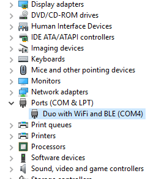

## Windows Driver Installation Guide

* Note 1: the driver is required for Windows only.

* Note 2: for Windows 10, it seems that you may skip this for Windows 10, since it already has a built in driver for Serial port (it shows as USB Serial Device).

* [Download](https://github.com/redbear/Duo/raw/master/driver/windows/duo_win_driver.zip) the Windows driver and unzip the file. It is fine to unzip this as a default into your 'Downloads' folder.

* In 'Control Panel' > 'Hardware and Sound', go to the 'Device Manager' and double-click on your Duo device under Other Devices (on Windows 10 your Duo device may be listed under Ports).

	
	
* Right click the device and click 'Update Driver', and select 'Browse for driver software'.

	

* On the next screen click 'Let me pick from a list of device drivers on my computer'

	

* Click the 'Have Disk...' button to open the directory to find 'duo.cat'.

	Navigate to your 'Downloads' folder, or wherever you unzipped the drivers, by clicking the 'Browse...' button and you will see the following screen, click next to install the driver.

	

* If you cannot install the driver, it is due to the driver is not digitally signed, applied to Windows 8 and 10.

	Please refer to [this link](http://www.howtogeek.com/167723/how-to-disable-driver-signature-verification-on-64-bit-windows-8.1-so-that-you-can-install-unsigned-drivers/) to disable the driver signature verification temporarily first and try again.

	Once you do that, start over from the Update Driver Software step. We are working on getting the driver signed so you won't have to do this anymore.

* If the follow screen prompt out, select 'Install this driver software anyway'.

	

* Driver installed.

	

* You will see 'Duo with WiFi and BLE' under Ports.

	

