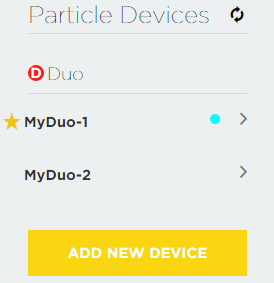
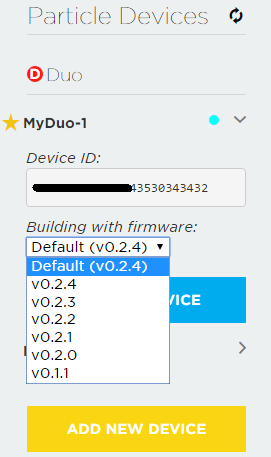
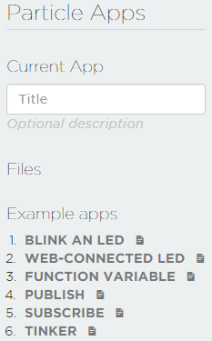
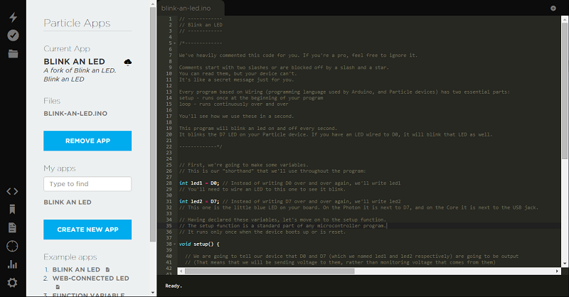

# Duo: Getting Started with Particle Build (Web IDE)
---

The Duo is installed the customed Particle firmware by default during manufacturing, which enables you developing applications using the Particle Build (aka. Particle online Web IDE). If you are running an application developed using WICED SDK, you will not able to access any of the services and tools provided by Particle, definitely including the Particle Build.

* [Requirements](#requirements)

## Requirements

* Particle account
* RedBear Duo development board
* Micro USB cable 

## Getting Started

1. Please follow the [Out-of-Box Experience](out_of_box_experience.md) to claim your Duo to the Particle Cloud.

2. Till now, we assume that your Duo has successfully connected to the Particle Cloud. Login [Particle Build](https://build.particle.io). Click on the  icon on the left tool bar, it will list all of your devices. Select the Duo you are going to flash an application by staring it on the left of its name. Note that the Duo you selected must come online, i.e. there is a cyan idot breathing within the same label of the Duo, or you won't able to OTA flash the application to the Duo you selected.

    

3. Click on the angle bracket on the right of the Duo you selected, you will see the Duo's device ID. Under the "***Building with firmware***" label, select the system firmware version for the application you are going to compile against. For now, you'd better select the one being equal to the system firmware version that is running on the Duo. Otherwise, the application you compiled and flashed may not work well on the Duo.

    

4. Click on the  icon on the left tool bar. On the spread menu, you can choose an example or create your own application to compile. Let's click on the "**1. BLINK AN LED**" to select it for  simple demonstration.

     

5. Click on the  icon on the left tool bar to compile and followed by OTA flashing the current application to your Duo. If you only want to verify the application, click on the  icon.

    

6. During OTA flashing the application, your Duo toggles in magenta and the Web IDE console prints:

        Flashing code...if it does not flash magenta, verify your code and try again.

    After OTA flash procedure completed, the Web IDE console prints:

        Flash successful! Please wait a moment while your device is updated...

    After a moment, your Duo will re-boot to run the new application, you'll see the on-board blue LED toggles in every second interval.

7. Well done! You could try more other examples that under the "**Example apps**" label or, just start creating your own applications with the online Web IDE!

**More informations about the Particle Build, please read the [Particle's online documentation](https://docs.particle.io/guide/getting-started/build/photon/).**

## Update System Firmware

We always recommend you update your Duo to the latest system firmware, since there may have new features added and bugfixes with a new released version. 

It is very easy to update your Duo's system firmware with the Particle Build. Simply choose an upper firmware version for the application you are going to compile against (see step 3 of the Getting Started section), and then OTA flash the application. It will automatically update your Duo's system firmware Over The Air. More details and other ways to update the system firmware, please refer to the [Firmware Deployment Guide](duo_firmware_deployment_guide.md).

You should note that the Particle Build only supports firmware upgrading, if you choose a lower firmware verison to compile against, it won't downgrade  the Duo's system firmware for you.

## What's Next

[Applications Development Guide](applications_development_guide.md)

## References

* [Duo Introduction](duo_introduction.md)
* [Firmware Architecture Overview](firmware_architecture_overview.md)
* [Particle Build](https://build.particle.io)
* [Particle Documentation](https://docs.particle.io/guide/getting-started/intro/photon/)
* [RedBear Discussion Forum](http://discuss.redbear.cc/)
* [Particle Community](https://community.particle.io/)

## Resources

* [Modified Particle firmware Source Code](https://github.com/redbear/firmware)
* [Application Examples](https://github.com/redbear/STM32-Arduino/tree/master/arduino/libraries/RedBear_Duo)

## License

Copyright (c) 2016 Red Bear

Permission is hereby granted, free of charge, to any person obtaining a copy of this software and associated documentation files (the "Software"), to deal in the Software without restriction, including without limitation the rights to use, copy, modify, merge, publish, distribute, sublicense, and/or sell copies of the Software, and to permit persons to whom the Software is furnished to do so, subject to the following conditions:

The above copyright notice and this permission notice shall be included in all copies or substantial portions of the Software.

THE SOFTWARE IS PROVIDED "AS IS", WITHOUT WARRANTY OF ANY KIND, EXPRESS OR IMPLIED, INCLUDING BUT NOT LIMITED TO THE WARRANTIES OF MERCHANTABILITY, FITNESS FOR A PARTICULAR PURPOSE AND NONINFRINGEMENT. IN NO EVENT SHALL THE AUTHORS OR COPYRIGHT HOLDERS BE LIABLE FOR ANY CLAIM, DAMAGES OR OTHER LIABILITY, WHETHER IN AN ACTION OF CONTRACT, TORT OR OTHERWISE, ARISING FROM, OUT OF OR IN CONNECTION WITH THE SOFTWARE OR THE USE OR OTHER DEALINGS IN THE SOFTWARE.